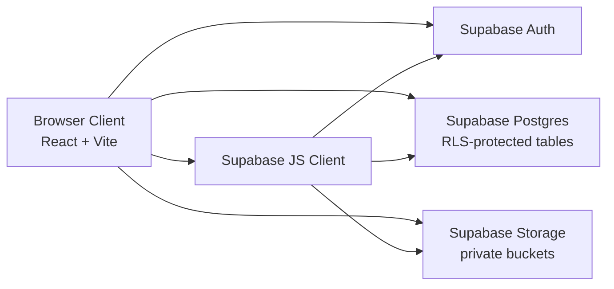
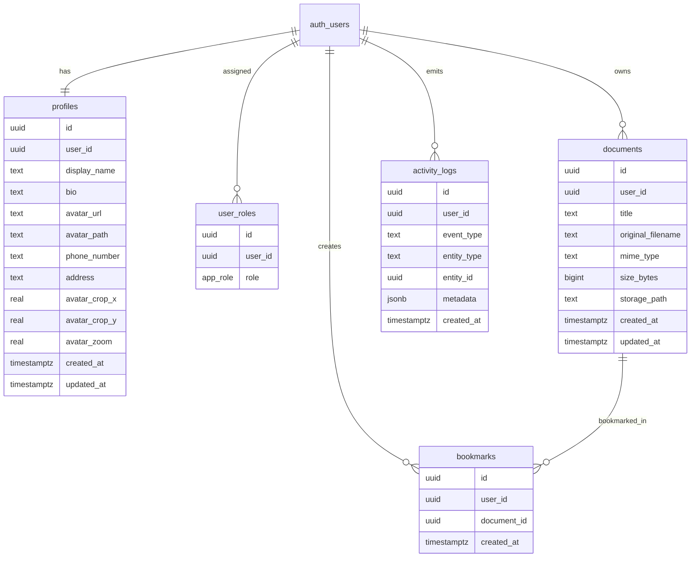

# Architecture

This document describes the current technical architecture of Document Hub.

## 1. High-Level System

## 2. Frontend Architecture

- Framework: React 18 + TypeScript + Vite
- Routing: React Router (route guards for protected/public pages)
- Data fetching/cache: TanStack Query
- UI stack: Tailwind CSS + shadcn/ui + Radix
- Runtime integration: `src/integrations/supabase/client.ts`

Primary page-level modules:

- `src/pages/Auth.tsx`
- `src/pages/Index.tsx` (dashboard)
- `src/pages/Documents.tsx`
- `src/pages/Bookmarks.tsx`
- `src/pages/Search.tsx`
- `src/pages/Profile.tsx`
- `src/pages/Settings.tsx`

## 3. Core Domain Model

## 4. Security Model

- All user-owned domain tables use RLS policies keyed by `auth.uid()`.
- Storage is private-first:
  - `documents` bucket private, per-user folder ownership checks.
  - `profile-avatars` bucket private, per-user folder ownership checks.
- Profiles use private storage path (`avatar_path`) rather than public URL for display.
- Reset-password flow is handled as a dedicated auth recovery state in app routing.

## 5. Main Request Flows

### Authentication

1. User signs in/up via Supabase Auth.
2. Signup trigger creates `profiles` and default `user_roles` row.
3. Route guards gate app pages based on auth session.

### Documents

1. User uploads file to private `documents` bucket path `${user_id}/...`.
2. App inserts metadata row into `public.documents`.
3. Dashboard, Search, and Bookmarks read from metadata tables.

### Profile Avatar

1. User captures/selects image in Profile.
2. Client uploads to private `profile-avatars` bucket under user folder.
3. App stores/updates `profiles.avatar_path`.
4. Client resolves image through signed access flow.

## 6. Migrations as Source of Truth

The schema and policies are managed through SQL migrations in:

- `supabase/migrations/`

Key milestones:

- Base profile/roles: `20260203182922_169167bc-2f58-4e89-84f4-8cd0d7241b4d.sql`
- Documents: `20260305102000_create_documents.sql`
- Bookmarks: `20260305113000_create_bookmarks.sql`
- Avatars and hardening: `20260305123000_create_profile_avatars_bucket.sql`, `20260305133000_secure_profile_avatars.sql`, `20260306100000_harden_profile_avatar_policies.sql`
- Profile extensions: `20260305143000_add_profile_contact_fields.sql`, `20260305150000_add_avatar_crop_fields.sql`
- Activity logs and upload limits: `20260305170000_add_activity_logs_and_upload_limits.sql`

## 7. Testing and Quality Gates

- Unit/component tests: Vitest + Testing Library
- E2E smoke baseline: Playwright (`e2e/auth-smoke.spec.ts`)
- CI workflow validates format, lint (non-blocking currently), tests, and build

## 8. Known Constraints

- Lint job is currently non-blocking in CI due existing legacy lint errors.
- Seeded document metadata rows are placeholders and do not create actual storage files.
